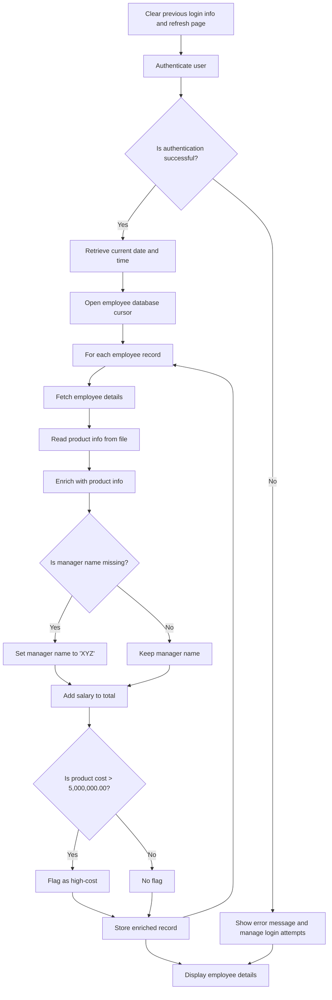
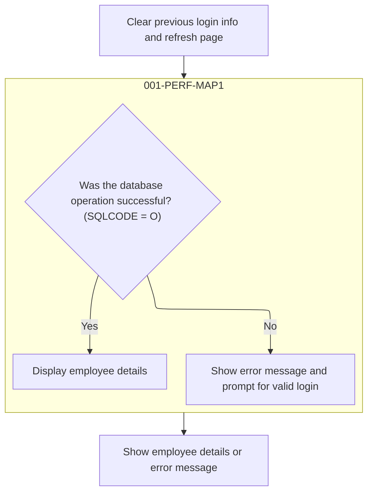
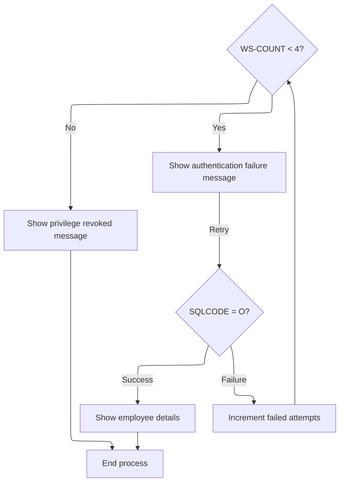

# Program Overview

This document describes the flow for authenticating users and displaying enriched employee details (PROJECT). Users provide login credentials, which are validated before employee records are retrieved and enriched with product and manager information. The flow ensures that only authenticated users can view employee details, and enriches the data with relevant product and manager info for display. If login fails, the user is prompted to retry or is shown a privilege revoked message after several failed attempts.

Main steps:

- Clear previous login info and refresh page
- Authenticate user
- Retrieve current date and time
- Open employee database cursor
- For each employee record: fetch details, enrich with product info, set manager name if missing, add salary to total, flag high-cost products, store record
- Display employee details or error message



## Dependencies

### Copybooks

- SQLCA
- <SwmToken path="src/PROJECT.CBL" pos="10:3:3" line-data="              INCLUDE DB2TAB0                                             ">`DB2TAB0`</SwmToken> (<SwmPath>[src/DB2TAB0.CPY](src/DB2TAB0.CPY)</SwmPath>)
- <SwmToken path="src/PROJECT.CBL" pos="115:5:5" line-data="                    FROM TRNGGRP.DB2TAB1                             ">`DB2TAB1`</SwmToken> (<SwmPath>[src/DB2TAB1.CPY](src/DB2TAB1.CPY)</SwmPath>)
- VSAMREC (<SwmPath>[src/VSAMREC.CPY](src/VSAMREC.CPY)</SwmPath>)
- <SwmToken path="src/PROJECT.CBL" pos="90:13:13" line-data="                 SEND MAP(&#39;LOGIN&#39;) MAPSET(&#39;TEC105M&#39;)                    ">`TEC105M`</SwmToken> (<SwmPath>[src/TEC105M.CPY](src/TEC105M.CPY)</SwmPath>)

# Program Workflow

# User Authentication and Entry Point



## Main Employee Details Retrieval

<SwmSnippet path="/src/PROJECT.CBL" line="72">

---

In <SwmToken path="src/PROJECT.CBL" pos="85:3:7" line-data="              PERFORM 001-PERF-MAP1                                     ">`001-PERF-MAP1`</SwmToken>, we only fetch and process employee details if the login and SQL check pass. Otherwise, we handle errors.

```cobol
           IF SQLCODE = O THEN                                           
               PERFORM 100-EMP-DETAILS                                  
               PERFORM 300-SEND-MAP                                     
               PERFORM 003-QUIT-PARA                                    
           ELSE                                                         
                PERFORM 200-ERROR-MSG                                   
           END-IF.                                                      
```

---

</SwmSnippet>

### Employee Data and Time Preparation

```mermaid
%%{init: {"flowchart": {"defaultRenderer": "elk"}} }%%
flowchart TD
    node1["Get current date and time"]
    click node1 openCode "src/PROJECT.CBL:100:109"
    node1 --> node2["Open employee database cursor"]
    click node2 openCode "src/PROJECT.CBL:112:119"
    node2 --> node3["Process employee records"]
    click node3 openCode "src/PROJECT.CBL:120:154"

    subgraph loop1["For each employee record"]
        node3 --> node4["Fetch employee details"]
        click node4 openCode "src/PROJECT.CBL:121:124"
        node4 --> node5["Read product info from file"]
        click node5 openCode "src/PROJECT.CBL:130:137"
        node5 --> node6{"Was file read successful?"}
        click node6 openCode "src/PROJECT.CBL:138:142"
        node6 -->|"Yes"| node7["Enrich with product info"]
        node6 -->|"No"| node7
        click node7 openCode "src/PROJECT.CBL:125:129"
        node7 --> node8{"Is manager name missing?"}
        click node8 openCode "src/PROJECT.CBL:143:146"
        node8 -->|"Yes"| node9["Set manager name to 'XYZ'"]
        click node9 openCode "src/PROJECT.CBL:144:145"
        node8 -->|"No"| node10["Keep manager name"]
        click node10 openCode "src/PROJECT.CBL:125:126"
        node9 --> node11["Add salary to total"]
        node10 --> node11
        click node11 openCode "src/PROJECT.CBL:127:128"
        node11 --> node12{"Is product cost > 5,000,000.00?"}
        click node12 openCode "src/PROJECT.CBL:149:151"
        node12 -->|"Yes"| node13["Flag as high-cost"]
        click node13 openCode "src/PROJECT.CBL:150:150"
        node12 -->|"No"| node14["No flag"]
        click node14 openCode "src/PROJECT.CBL:152:152"
        node13 --> node15["Store enriched record"]
        node14 --> node15
        click node15 openCode "src/PROJECT.CBL:152:153"
        node15 --> node3
    end

%% Swimm:
%% %%{init: {"flowchart": {"defaultRenderer": "elk"}} }%%
%% flowchart TD
%%     node1["Get current date and time"]
%%     click node1 openCode "<SwmPath>[src/PROJECT.CBL](src/PROJECT.CBL)</SwmPath>:100:109"
%%     node1 --> node2["Open employee database cursor"]
%%     click node2 openCode "<SwmPath>[src/PROJECT.CBL](src/PROJECT.CBL)</SwmPath>:112:119"
%%     node2 --> node3["Process employee records"]
%%     click node3 openCode "<SwmPath>[src/PROJECT.CBL](src/PROJECT.CBL)</SwmPath>:120:154"
%% 
%%     subgraph loop1["For each employee record"]
%%         node3 --> node4["Fetch employee details"]
%%         click node4 openCode "<SwmPath>[src/PROJECT.CBL](src/PROJECT.CBL)</SwmPath>:121:124"
%%         node4 --> node5["Read product info from file"]
%%         click node5 openCode "<SwmPath>[src/PROJECT.CBL](src/PROJECT.CBL)</SwmPath>:130:137"
%%         node5 --> node6{"Was file read successful?"}
%%         click node6 openCode "<SwmPath>[src/PROJECT.CBL](src/PROJECT.CBL)</SwmPath>:138:142"
%%         node6 -->|"Yes"| node7["Enrich with product info"]
%%         node6 -->|"No"| node7
%%         click node7 openCode "<SwmPath>[src/PROJECT.CBL](src/PROJECT.CBL)</SwmPath>:125:129"
%%         node7 --> node8{"Is manager name missing?"}
%%         click node8 openCode "<SwmPath>[src/PROJECT.CBL](src/PROJECT.CBL)</SwmPath>:143:146"
%%         node8 -->|"Yes"| node9["Set manager name to 'XYZ'"]
%%         click node9 openCode "<SwmPath>[src/PROJECT.CBL](src/PROJECT.CBL)</SwmPath>:144:145"
%%         node8 -->|"No"| node10["Keep manager name"]
%%         click node10 openCode "<SwmPath>[src/PROJECT.CBL](src/PROJECT.CBL)</SwmPath>:125:126"
%%         node9 --> node11["Add salary to total"]
%%         node10 --> node11
%%         click node11 openCode "<SwmPath>[src/PROJECT.CBL](src/PROJECT.CBL)</SwmPath>:127:128"
%%         node11 --> node12{"Is product cost > 5,000,000.00?"}
%%         click node12 openCode "<SwmPath>[src/PROJECT.CBL](src/PROJECT.CBL)</SwmPath>:149:151"
%%         node12 -->|"Yes"| node13["Flag as high-cost"]
%%         click node13 openCode "<SwmPath>[src/PROJECT.CBL](src/PROJECT.CBL)</SwmPath>:150:150"
%%         node12 -->|"No"| node14["No flag"]
%%         click node14 openCode "<SwmPath>[src/PROJECT.CBL](src/PROJECT.CBL)</SwmPath>:152:152"
%%         node13 --> node15["Store enriched record"]
%%         node14 --> node15
%%         click node15 openCode "<SwmPath>[src/PROJECT.CBL](src/PROJECT.CBL)</SwmPath>:152:153"
%%         node15 --> node3
%%     end
```



<SwmSnippet path="/src/PROJECT.CBL" line="99">

---

In <SwmToken path="src/PROJECT.CBL" pos="99:1:5" line-data="       100-EMP-DETAILS.                                                 ">`100-EMP-DETAILS`</SwmToken>, we grab the current time from CICS, format it, and store the results in DATEO and TIMEO. This sets up the timestamp info that will be shown with the employee data.

```cobol
       100-EMP-DETAILS.                                                 
              EXEC CICS ASKTIME                                         
                 ABSTIME(ASK-TIME)                                      
              END-EXEC.                                                 
              EXEC CICS                                                 
                FORMATTIME ABSTIME(ASK-TIME)                            
                 YYYYMMDD(ASK-DATE1)                                    
                  DATESEP('/')                                          
                   TIME(ASK-TIME1)                                      
                    TIMESEP                                             
               END-EXEC.                                                
```

---

</SwmSnippet>

<SwmSnippet path="/src/PROJECT.CBL" line="110">

---

After formatting and storing the date/time, we declare and open the SQL cursor to start fetching employee records. This keeps the timestamp consistent for all data retrieved in this session.

```cobol
               MOVE ASK-DATE1 TO DATEO.                                 
               MOVE ASK-TIME1 TO TIMEO.                                 
               EXEC SQL                                                 
                DECLARE EMPCUR CURSOR FOR                               
                  SELECT ENO,DNO,ENAME,SALARY                           
                    FROM TRNGGRP.DB2TAB1                             
               END-EXEC.                                                
               EXEC SQL                                                 
                 OPEN EMPCUR                                            
               END-EXEC.                                                
```

---

</SwmSnippet>

<SwmSnippet path="/src/PROJECT.CBL" line="120">

---

We loop through employee records, fetching one at a time for processing.

```cobol
              PERFORM VARYING I FROM 1 BY 1 UNTIL SQLCODE NOT = 0       
               EXEC SQL                                                 
                FETCH EMPCUR                                            
                  INTO :HENO,:HDNO,:HENAME,:HSALARY                     
               END-EXEC                                                 
```

---

</SwmSnippet>

<SwmSnippet path="/src/PROJECT.CBL" line="125">

---

After fetching the employee data, we copy it into working storage and use the department number to read related info from the VSAM file. This ties each employee to their department's extra data.

```cobol
               MOVE HENO TO WS-ENO                                      
               MOVE HENAME TO WS-ENAME                                  
               MOVE HSALARY TO WS-SALARY WS-SAL                         
               COMPUTE WS-TOTAL = WS-TOTAL + WS-SAL                     
               MOVE HDNO TO REC-KEY                                     
               EXEC CICS                                                
                 READ                                                  
                  FILE('VSAB13')                                       
                   INTO(WS-REC1)                                        
                    RIDFLD(REC-KEY)                                     
                     RESP(WS-RESP)                                      
                      LENGTH(LENGTH OF WS-REC1)                         
               END-EXEC                                                 
```

---

</SwmSnippet>

<SwmSnippet path="/src/PROJECT.CBL" line="138">

---

If the VSAM file read works, we grab product and manufacturer info for the employee. If not, we skip this enrichment.

```cobol
               IF WS-RESP = DFHRESP(NORMAL) THEN                        
                 MOVE WS-PNAME1 TO WS-PNAME 
                 MOVE WS-PCOST1 TO WS-PCOST                            
                 MOVE WS-MNAME1 TO WS-MNAME                             
               END-IF                                                   
```

---

</SwmSnippet>

<SwmSnippet path="/src/PROJECT.CBL" line="143">

---

If the manufacturer name is missing, we set it to 'XYZ' so we don't show blanks in the output.

```cobol
               IF WS-MNAME1 IS EQUAL TO SPACES THEN                     
                  MOVE 'XYZ' TO WS-MNAME1                               
                  MOVE WS-MNAME1 TO WS-MNAME                            
               END-IF                                                   
```

---

</SwmSnippet>

<SwmSnippet path="/src/PROJECT.CBL" line="147">

---

We flag expensive records, update totals, and store all processed data for later use.

```cobol
                 MOVE I TO WS-SNO                                       
               IF SQLCODE = 0 THEN                                      
                IF WS-PCOST > 5000000.00 THEN                               
                 MOVE '2' TO RECC(I)                                    
                END-IF                                                  
                MOVE WS-IN TO RECO(I)                                   
                END-IF                                                  
               END-PERFORM.                                             
```

---

</SwmSnippet>

### Displaying Employee Data



<SwmSnippet path="/src/PROJECT.CBL" line="72">

---

After getting employee data, we show it on the screen using <SwmToken path="src/PROJECT.CBL" pos="74:3:7" line-data="               PERFORM 300-SEND-MAP                                     ">`300-SEND-MAP`</SwmToken>.

```cobol
           IF SQLCODE = O THEN                                           
               PERFORM 100-EMP-DETAILS                                  
               PERFORM 300-SEND-MAP                                     
               PERFORM 003-QUIT-PARA                                    
           ELSE                                                         
                PERFORM 200-ERROR-MSG                                   
           END-IF.                                                      
```

---

</SwmSnippet>

<SwmSnippet path="/src/PROJECT.CBL" line="155">

---

<SwmToken path="src/PROJECT.CBL" pos="155:1:5" line-data="        300-SEND-MAP.                                                   ">`300-SEND-MAP`</SwmToken> moves the total and info header to output fields, then calls the CICS SEND MAP command to show the employee details screen. The ERASE option clears the terminal before display.

```cobol
        300-SEND-MAP.                                                   
               MOVE WS-TOTAL TO TOTALO.                                 
               MOVE 'EMPLOYEE DETAILS' TO INFO2O                        
               EXEC CICS                                                
                   SEND MAP('EMPD') MAPSET('TEC105M')                   
                    ERASE                                               
               END-EXEC.                                                
```

---

</SwmSnippet>

<SwmSnippet path="/src/PROJECT.CBL" line="72">

---

Back in <SwmToken path="src/PROJECT.CBL" pos="85:3:7" line-data="              PERFORM 001-PERF-MAP1                                     ">`001-PERF-MAP1`</SwmToken>, if the SQL check fails, we jump to <SwmToken path="src/PROJECT.CBL" pos="77:3:7" line-data="                PERFORM 200-ERROR-MSG                                   ">`200-ERROR-MSG`</SwmToken> to handle login errors and show the right messages to the user.

```cobol
           IF SQLCODE = O THEN                                           
               PERFORM 100-EMP-DETAILS                                  
               PERFORM 300-SEND-MAP                                     
               PERFORM 003-QUIT-PARA                                    
           ELSE                                                         
                PERFORM 200-ERROR-MSG                                   
           END-IF.                                                      
```

---

</SwmSnippet>

<SwmSnippet path="/src/PROJECT.CBL" line="79">

---

<SwmToken path="src/PROJECT.CBL" pos="79:1:5" line-data="       200-ERROR-MSG.                                                   ">`200-ERROR-MSG`</SwmToken> bumps the login attempt count, resets fields if under the limit, and shows error messages. If the limit is hit, it revokes access and ends the session.

```cobol
       200-ERROR-MSG.                                                   
            COMPUTE WS-COUNT = WS-COUNT + 1.                            
             IF ( WS-COUNT < 4 ) THEN                                   
              MOVE LOW-VALUES TO LOGINO                                 
              MOVE 'ENTER VALID LOGIN DETAILS' TO MSGO                  
              MOVE 'ATHENTICATION FAILURE PAGE' TO INFO1O               
              PERFORM 001-PERF-MAP1                                     
            ELSE                                                        
               MOVE 'REVOKED PAGE' TO INFO1O                            
               MOVE 'YOUR PREVILAGE IS REVOKED' TO MSGO                 
             EXEC CICS                                                  
                 SEND MAP('LOGIN') MAPSET('TEC105M')                    
                  ERASE                                                 
             END-EXEC                                                   
            PERFORM 003-QUIT-PARA                                       
            END-IF.                                                     
```

---

</SwmSnippet>

## Refreshing the Login State

<SwmSnippet path="/src/PROJECT.CBL" line="95">

---

<SwmToken path="src/PROJECT.CBL" pos="95:1:5" line-data="       002-REFRESH-PARA.                                                ">`002-REFRESH-PARA`</SwmToken> clears the login fields and sets the info message, then calls <SwmToken path="src/PROJECT.CBL" pos="98:3:7" line-data="             PERFORM 001-PERF-MAP1.                                     ">`001-PERF-MAP1`</SwmToken> to restart the login flow with a fresh state.

```cobol
       002-REFRESH-PARA.                                                
             MOVE LOW-VALUES TO LOGINO.                                 
             MOVE 'REFRESH PAGE' TO INFO1O.                             
             PERFORM 001-PERF-MAP1.                                     
```

---

</SwmSnippet>

&nbsp;

*This is an auto-generated document by Swimm 🌊 and has not yet been verified by a human*

<SwmMeta version="3.0.0" repo-id="Z2l0aHViJTNBJTNBU3dpbW1pby1Qcm9qMiUzQSUzQUdpcmktU3dpbW0=" repo-name="Swimmio-Proj2"><sup>Powered by [Swimm](https://app.swimm.io/)</sup></SwmMeta>
