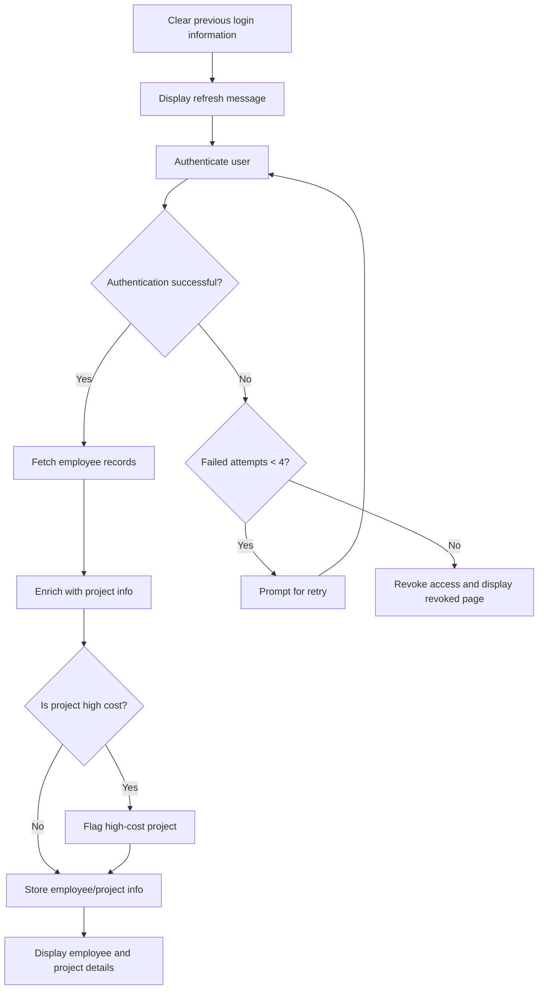
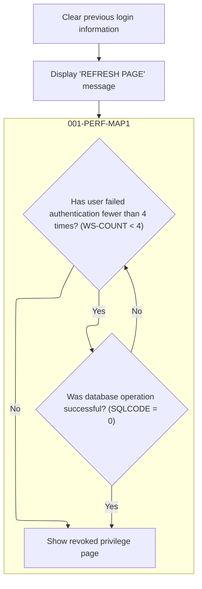
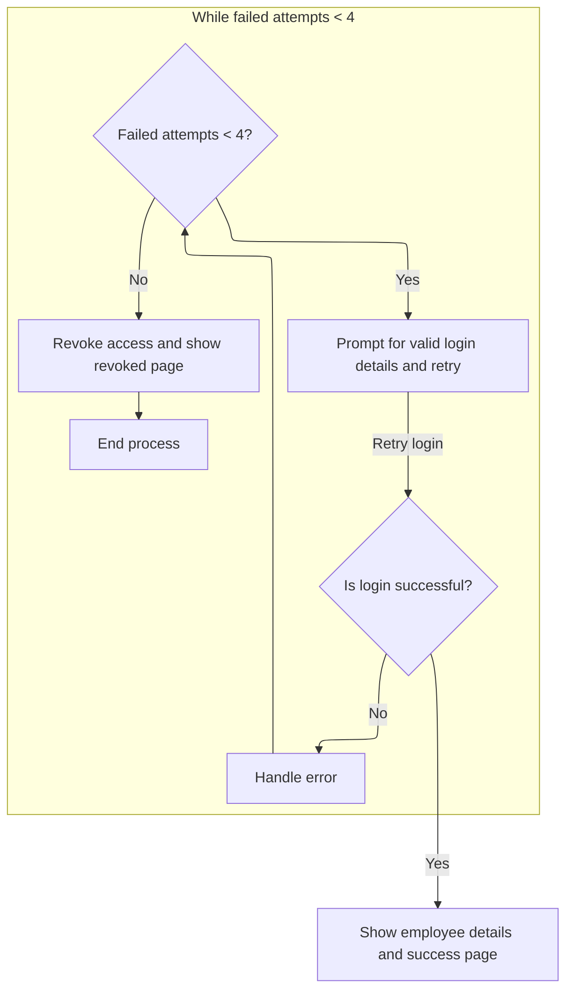

# Program Overview

This document describes the flow for authenticating users and displaying employee/project details (PROJECT). The program receives user login credentials, verifies them, and if successful, retrieves employee records from the database, enriches them with project information, and highlights high-cost projects. If authentication fails, the user is prompted to retry, and access is revoked after several failed attempts.

Main steps:

- Clear previous login information and refresh session
- Display refresh message
- Authenticate user and retrieve details
- Fetch and process employee records
- Enrich employee data with project info
- Mark high-cost projects
- Display results or handle authentication failures



## Dependencies

### Copybooks

- SQLCA
- <SwmToken path="src/PROJECT.CBL" pos="10:3:3" line-data="              INCLUDE DB2TAB0                                             ">`DB2TAB0`</SwmToken> (<SwmPath>[src/DB2TAB0.CPY](src/DB2TAB0.CPY)</SwmPath>)
- <SwmToken path="src/PROJECT.CBL" pos="115:5:5" line-data="                    FROM TRNGGRP.DB2TAB1                             ">`DB2TAB1`</SwmToken> (<SwmPath>[src/DB2TAB1.CPY](src/DB2TAB1.CPY)</SwmPath>)
- VSAMREC (<SwmPath>[src/VSAMREC.CPY](src/VSAMREC.CPY)</SwmPath>)
- <SwmToken path="src/PROJECT.CBL" pos="90:13:13" line-data="                 SEND MAP(&#39;LOGIN&#39;) MAPSET(&#39;TEC105M&#39;)                    ">`TEC105M`</SwmToken> (<SwmPath>[src/TEC105M.CPY](src/TEC105M.CPY)</SwmPath>)

# Program Workflow

# Entry Point and Initial Decision



## User Authentication and Data Retrieval

<SwmSnippet path="/src/PROJECT.CBL" line="72">

---

In <SwmToken path="src/PROJECT.CBL" pos="85:3:7" line-data="              PERFORM 001-PERF-MAP1                                     ">`001-PERF-MAP1`</SwmToken>, we check authentication, and if it's good, we fetch employee details next. If not, we handle errors.

```cobol
           IF SQLCODE = O THEN                                           
               PERFORM 100-EMP-DETAILS                                  
               PERFORM 300-SEND-MAP                                     
               PERFORM 003-QUIT-PARA                                    
           ELSE                                                         
                PERFORM 200-ERROR-MSG                                   
           END-IF.                                                      
```

---

</SwmSnippet>

### Employee Data and Project Info Fetch

```mermaid
%%{init: {"flowchart": {"defaultRenderer": "elk"}} }%%
flowchart TD
    node1["Get current date and time"]
    click node1 openCode "src/PROJECT.CBL:100:109"
    node1 --> node2["Open employee database cursor"]
    click node2 openCode "src/PROJECT.CBL:112:119"
    node2 --> node3["Process employee records"]
    click node3 openCode "src/PROJECT.CBL:120:154"
    
    subgraph loop1["For each employee record in the database"]
      node3 --> node4["Fetch employee details"]
      click node4 openCode "src/PROJECT.CBL:121:124"
      node4 --> node5["Read product info for employee"]
      click node5 openCode "src/PROJECT.CBL:130:137"
      node5 --> node6{"Was product info found?"}
      click node6 openCode "src/PROJECT.CBL:138:142"
      node6 -->|"Yes"| node7["Enrich with product info"]
      click node7 openCode "src/PROJECT.CBL:139:141"
      node6 -->|"No"| node8["Continue without enrichment"]
      click node8 openCode "src/PROJECT.CBL:138:142"
      node7 --> node9{"Is manager name missing?"}
      click node9 openCode "src/PROJECT.CBL:143:146"
      node8 --> node9
      node9 -->|"Yes"| node10["Set manager name to 'XYZ'"]
      click node10 openCode "src/PROJECT.CBL:144:145"
      node9 -->|"No"| node11["Continue"]
      click node11 openCode "src/PROJECT.CBL:147:153"
      node10 --> node11
      node11 --> node12["Add salary to total"]
      click node12 openCode "src/PROJECT.CBL:128:128"
      node12 --> node13{"Is product cost > 5,000,000.00?"}
      click node13 openCode "src/PROJECT.CBL:149:151"
      node13 -->|"Yes"| node14["Mark product as high cost"]
      click node14 openCode "src/PROJECT.CBL:150:150"
      node13 -->|"No"| node15["Store employee and product info"]
      click node15 openCode "src/PROJECT.CBL:152:152"
      node14 --> node15
      node15 --> node16{"More employee records?"}
      click node16 openCode "src/PROJECT.CBL:120:154"
      node16 -->|"Yes"| node4
      node16 -->|"No"| node17["End: All records processed"]
      click node17 openCode "src/PROJECT.CBL:154:154"
    end

%% Swimm:
%% %%{init: {"flowchart": {"defaultRenderer": "elk"}} }%%
%% flowchart TD
%%     node1["Get current date and time"]
%%     click node1 openCode "<SwmPath>[src/PROJECT.CBL](src/PROJECT.CBL)</SwmPath>:100:109"
%%     node1 --> node2["Open employee database cursor"]
%%     click node2 openCode "<SwmPath>[src/PROJECT.CBL](src/PROJECT.CBL)</SwmPath>:112:119"
%%     node2 --> node3["Process employee records"]
%%     click node3 openCode "<SwmPath>[src/PROJECT.CBL](src/PROJECT.CBL)</SwmPath>:120:154"
%%     
%%     subgraph loop1["For each employee record in the database"]
%%       node3 --> node4["Fetch employee details"]
%%       click node4 openCode "<SwmPath>[src/PROJECT.CBL](src/PROJECT.CBL)</SwmPath>:121:124"
%%       node4 --> node5["Read product info for employee"]
%%       click node5 openCode "<SwmPath>[src/PROJECT.CBL](src/PROJECT.CBL)</SwmPath>:130:137"
%%       node5 --> node6{"Was product info found?"}
%%       click node6 openCode "<SwmPath>[src/PROJECT.CBL](src/PROJECT.CBL)</SwmPath>:138:142"
%%       node6 -->|"Yes"| node7["Enrich with product info"]
%%       click node7 openCode "<SwmPath>[src/PROJECT.CBL](src/PROJECT.CBL)</SwmPath>:139:141"
%%       node6 -->|"No"| node8["Continue without enrichment"]
%%       click node8 openCode "<SwmPath>[src/PROJECT.CBL](src/PROJECT.CBL)</SwmPath>:138:142"
%%       node7 --> node9{"Is manager name missing?"}
%%       click node9 openCode "<SwmPath>[src/PROJECT.CBL](src/PROJECT.CBL)</SwmPath>:143:146"
%%       node8 --> node9
%%       node9 -->|"Yes"| node10["Set manager name to 'XYZ'"]
%%       click node10 openCode "<SwmPath>[src/PROJECT.CBL](src/PROJECT.CBL)</SwmPath>:144:145"
%%       node9 -->|"No"| node11["Continue"]
%%       click node11 openCode "<SwmPath>[src/PROJECT.CBL](src/PROJECT.CBL)</SwmPath>:147:153"
%%       node10 --> node11
%%       node11 --> node12["Add salary to total"]
%%       click node12 openCode "<SwmPath>[src/PROJECT.CBL](src/PROJECT.CBL)</SwmPath>:128:128"
%%       node12 --> node13{"Is product cost > 5,000,000.00?"}
%%       click node13 openCode "<SwmPath>[src/PROJECT.CBL](src/PROJECT.CBL)</SwmPath>:149:151"
%%       node13 -->|"Yes"| node14["Mark product as high cost"]
%%       click node14 openCode "<SwmPath>[src/PROJECT.CBL](src/PROJECT.CBL)</SwmPath>:150:150"
%%       node13 -->|"No"| node15["Store employee and product info"]
%%       click node15 openCode "<SwmPath>[src/PROJECT.CBL](src/PROJECT.CBL)</SwmPath>:152:152"
%%       node14 --> node15
%%       node15 --> node16{"More employee records?"}
%%       click node16 openCode "<SwmPath>[src/PROJECT.CBL](src/PROJECT.CBL)</SwmPath>:120:154"
%%       node16 -->|"Yes"| node4
%%       node16 -->|"No"| node17["End: All records processed"]
%%       click node17 openCode "<SwmPath>[src/PROJECT.CBL](src/PROJECT.CBL)</SwmPath>:154:154"
%%     end
```



<SwmSnippet path="/src/PROJECT.CBL" line="99">

---

In <SwmToken path="src/PROJECT.CBL" pos="99:1:5" line-data="       100-EMP-DETAILS.                                                 ">`100-EMP-DETAILS`</SwmToken>, we grab the current time and date using CICS commands, format them, and store them in DATEO and TIMEO. This sets up the timestamp info for later use in the flow.

```cobol
       100-EMP-DETAILS.                                                 
              EXEC CICS ASKTIME                                         
                 ABSTIME(ASK-TIME)                                      
              END-EXEC.                                                 
              EXEC CICS                                                 
                FORMATTIME ABSTIME(ASK-TIME)                            
                 YYYYMMDD(ASK-DATE1)                                    
                  DATESEP('/')                                          
                   TIME(ASK-TIME1)                                      
                    TIMESEP                                             
               END-EXEC.                                                
```

---

</SwmSnippet>

<SwmSnippet path="/src/PROJECT.CBL" line="110">

---

After setting up the time and date, we declare and open a SQL cursor to start pulling employee records from the DB2 table. This kicks off the main data fetch loop.

```cobol
               MOVE ASK-DATE1 TO DATEO.                                 
               MOVE ASK-TIME1 TO TIMEO.                                 
               EXEC SQL                                                 
                DECLARE EMPCUR CURSOR FOR                               
                  SELECT ENO,DNO,ENAME,SALARY                           
                    FROM TRNGGRP.DB2TAB1                             
               END-EXEC.                                                
               EXEC SQL                                                 
                 OPEN EMPCUR                                            
               END-EXEC.                                                
```

---

</SwmSnippet>

<SwmSnippet path="/src/PROJECT.CBL" line="120">

---

We fetch employee records in a loop, stopping when there are no more rows.

```cobol
              PERFORM VARYING I FROM 1 BY 1 UNTIL SQLCODE NOT = 0       
               EXEC SQL                                                 
                FETCH EMPCUR                                            
                  INTO :HENO,:HDNO,:HENAME,:HSALARY                     
               END-EXEC                                                 
```

---

</SwmSnippet>

<SwmSnippet path="/src/PROJECT.CBL" line="125">

---

For each employee, we store their info, add their salary to the total, and fetch project details using their department number.

```cobol
               MOVE HENO TO WS-ENO                                      
               MOVE HENAME TO WS-ENAME                                  
               MOVE HSALARY TO WS-SALARY WS-SAL                         
               COMPUTE WS-TOTAL = WS-TOTAL + WS-SAL                     
               MOVE HDNO TO REC-KEY                                     
               EXEC CICS                                                
                 READ                                                  
                  FILE('VSAB13')                                       
                   INTO(WS-REC1)                                        
                    RIDFLD(REC-KEY)                                     
                     RESP(WS-RESP)                                      
                      LENGTH(LENGTH OF WS-REC1)                         
               END-EXEC                                                 
```

---

</SwmSnippet>

<SwmSnippet path="/src/PROJECT.CBL" line="138">

---

We only update project info if the VSAM read worked.

```cobol
               IF WS-RESP = DFHRESP(NORMAL) THEN                        
                 MOVE WS-PNAME1 TO WS-PNAME 
                 MOVE WS-PCOST1 TO WS-PCOST                            
                 MOVE WS-MNAME1 TO WS-MNAME                             
               END-IF                                                   
```

---

</SwmSnippet>

<SwmSnippet path="/src/PROJECT.CBL" line="143">

---

If the manufacturer name is blank, we set it to 'XYZ' so the field is never empty in the output or UI.

```cobol
               IF WS-MNAME1 IS EQUAL TO SPACES THEN                     
                  MOVE 'XYZ' TO WS-MNAME1                               
                  MOVE WS-MNAME1 TO WS-MNAME                            
               END-IF                                                   
```

---

</SwmSnippet>

<SwmSnippet path="/src/PROJECT.CBL" line="147">

---

We set up the loop index and mark high-cost projects in RECC. All processed records are stored in RECO for later use, like display or reporting.

```cobol
                 MOVE I TO WS-SNO                                       
               IF SQLCODE = 0 THEN                                      
                IF WS-PCOST > 5000000.00 THEN                               
                 MOVE '2' TO RECC(I)                                    
                END-IF                                                  
                MOVE WS-IN TO RECO(I)                                   
                END-IF                                                  
               END-PERFORM.                                             
```

---

</SwmSnippet>

### Display Results and Session End



<SwmSnippet path="/src/PROJECT.CBL" line="72">

---

After returning from <SwmToken path="src/PROJECT.CBL" pos="73:3:7" line-data="               PERFORM 100-EMP-DETAILS                                  ">`100-EMP-DETAILS`</SwmToken> in <SwmToken path="src/PROJECT.CBL" pos="85:3:7" line-data="              PERFORM 001-PERF-MAP1                                     ">`001-PERF-MAP1`</SwmToken>, we send the processed data to the UI and quit. If authentication or data fetch failed, we call <SwmToken path="src/PROJECT.CBL" pos="77:3:7" line-data="                PERFORM 200-ERROR-MSG                                   ">`200-ERROR-MSG`</SwmToken> to handle errors and inform the user before ending the session.

```cobol
           IF SQLCODE = O THEN                                           
               PERFORM 100-EMP-DETAILS                                  
               PERFORM 300-SEND-MAP                                     
               PERFORM 003-QUIT-PARA                                    
           ELSE                                                         
                PERFORM 200-ERROR-MSG                                   
           END-IF.                                                      
```

---

</SwmSnippet>

<SwmSnippet path="/src/PROJECT.CBL" line="79">

---

<SwmToken path="src/PROJECT.CBL" pos="79:1:5" line-data="       200-ERROR-MSG.                                                   ">`200-ERROR-MSG`</SwmToken> handles login failures by counting attempts. If it's under 4, we reset login fields and prompt the user to try again. At 4 or more, we show a revoked message, send a map to the UI, and quit. The CICS SEND MAP command updates the screen, and the quit subroutine ends the session.

```cobol
       200-ERROR-MSG.                                                   
            COMPUTE WS-COUNT = WS-COUNT + 1.                            
             IF ( WS-COUNT < 4 ) THEN                                   
              MOVE LOW-VALUES TO LOGINO                                 
              MOVE 'ENTER VALID LOGIN DETAILS' TO MSGO                  
              MOVE 'ATHENTICATION FAILURE PAGE' TO INFO1O               
              PERFORM 001-PERF-MAP1                                     
            ELSE                                                        
               MOVE 'REVOKED PAGE' TO INFO1O                            
               MOVE 'YOUR PREVILAGE IS REVOKED' TO MSGO                 
             EXEC CICS                                                  
                 SEND MAP('LOGIN') MAPSET('TEC105M')                    
                  ERASE                                                 
             END-EXEC                                                   
            PERFORM 003-QUIT-PARA                                       
            END-IF.                                                     
```

---

</SwmSnippet>

## Session Refresh and Re-authentication

<SwmSnippet path="/src/PROJECT.CBL" line="95">

---

<SwmToken path="src/PROJECT.CBL" pos="95:1:5" line-data="       002-REFRESH-PARA.                                                ">`002-REFRESH-PARA`</SwmToken> clears the login fields and sets the info to 'REFRESH PAGE', then calls <SwmToken path="src/PROJECT.CBL" pos="98:3:7" line-data="             PERFORM 001-PERF-MAP1.                                     ">`001-PERF-MAP1`</SwmToken> to restart authentication. This gives the user a fresh session.

```cobol
       002-REFRESH-PARA.                                                
             MOVE LOW-VALUES TO LOGINO.                                 
             MOVE 'REFRESH PAGE' TO INFO1O.                             
             PERFORM 001-PERF-MAP1.                                     
```

---

</SwmSnippet>

&nbsp;

*This is an auto-generated document by Swimm 🌊 and has not yet been verified by a human*

<SwmMeta version="3.0.0" repo-id="Z2l0aHViJTNBJTNBU3dpbW1pby1Qcm9qMiUzQSUzQUdpcmktU3dpbW0=" repo-name="Swimmio-Proj2"><sup>Powered by [Swimm](https://app.swimm.io/)</sup></SwmMeta>
