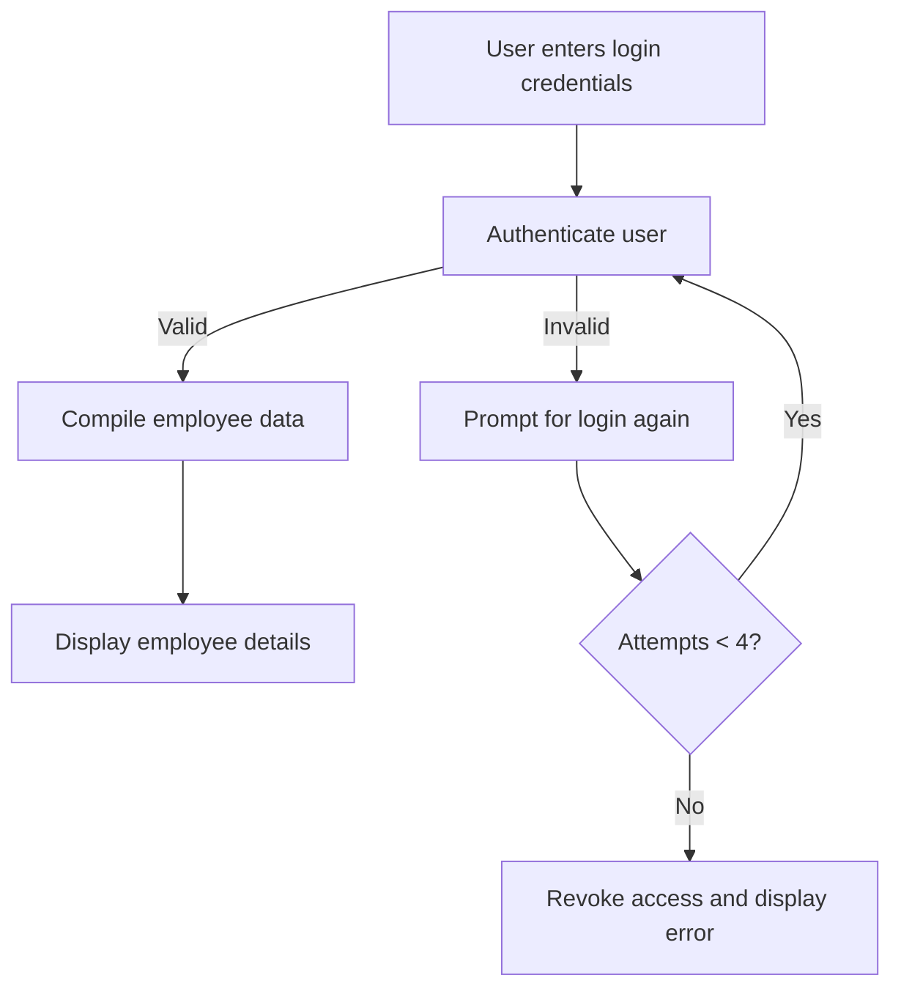
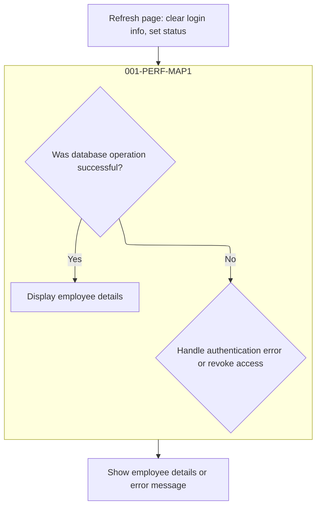
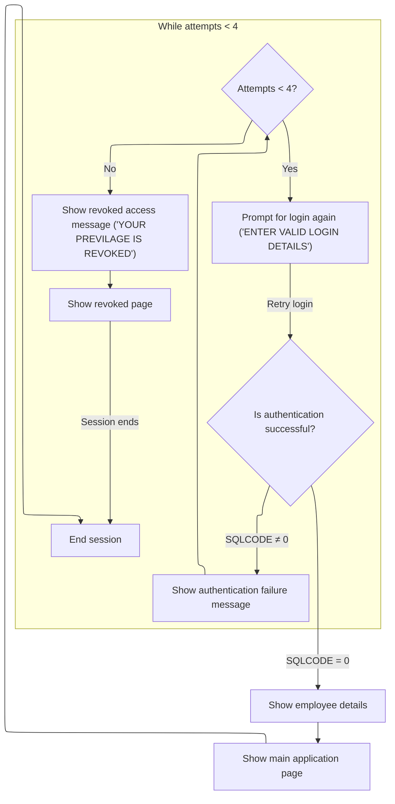

# Program Overview

This document describes the flow for validating user login and displaying employee details (PROJECT). Users enter their credentials to access employee information. The program authenticates the user, compiles employee data including product and manager info, and presents it on the main page. If authentication fails, the user is prompted to try again, and after several failed attempts, access is revoked.

For example, when a user enters their login credentials, the program checks them against the database. If valid, it retrieves and displays employee details; if not, it shows an error and allows up to four attempts before revoking access.

The main steps are:

- Authenticate user
- Compile employee data with product and manager info
- Display employee details
- Handle authentication errors and access revocation



## Dependencies

### Copybooks

- SQLCA
- <SwmToken path="src/PROJECT.CBL" pos="10:3:3" line-data="              INCLUDE DB2TAB0                                             ">`DB2TAB0`</SwmToken> (<SwmPath>[src/DB2TAB0.CPY](src/DB2TAB0.CPY)</SwmPath>)
- <SwmToken path="src/PROJECT.CBL" pos="115:5:5" line-data="                    FROM TRNGGRP.DB2TAB1                             ">`DB2TAB1`</SwmToken> (<SwmPath>[src/DB2TAB1.CPY](src/DB2TAB1.CPY)</SwmPath>)
- VSAMREC (<SwmPath>[src/VSAMREC.CPY](src/VSAMREC.CPY)</SwmPath>)
- <SwmToken path="src/PROJECT.CBL" pos="90:13:13" line-data="                 SEND MAP(&#39;LOGIN&#39;) MAPSET(&#39;TEC105M&#39;)                    ">`TEC105M`</SwmToken> (<SwmPath>[src/TEC105M.CPY](src/TEC105M.CPY)</SwmPath>)

# Program Workflow

# Login Validation Entry Point



## User Authentication and Employee Data Retrieval

<SwmSnippet path="/src/PROJECT.CBL" line="72">

---

In <SwmToken path="src/PROJECT.CBL" pos="85:3:7" line-data="              PERFORM 001-PERF-MAP1                                     ">`001-PERF-MAP1`</SwmToken>, we check if the SQL operation succeeded. If it did, we call <SwmToken path="src/PROJECT.CBL" pos="73:3:7" line-data="               PERFORM 100-EMP-DETAILS                                  ">`100-EMP-DETAILS`</SwmToken> to gather and process employee data, then send it to the UI and end the session. If not, we jump to error handling. Calling <SwmToken path="src/PROJECT.CBL" pos="73:3:7" line-data="               PERFORM 100-EMP-DETAILS                                  ">`100-EMP-DETAILS`</SwmToken> here is necessary because we need the processed employee info before we can display anything meaningful to the user.

```cobol
           IF SQLCODE = O THEN                                           
               PERFORM 100-EMP-DETAILS                                  
               PERFORM 300-SEND-MAP                                     
               PERFORM 003-QUIT-PARA                                    
           ELSE                                                         
                PERFORM 200-ERROR-MSG                                   
           END-IF.                                                      
```

---

</SwmSnippet>

### Employee Data Compilation and Tagging

```mermaid
%%{init: {"flowchart": {"defaultRenderer": "elk"}} }%%
flowchart TD
    node1["Get current date and time"]
    click node1 openCode "src/PROJECT.CBL:99:109"
    node1 --> node2["Open employee database cursor"]
    click node2 openCode "src/PROJECT.CBL:110:119"
    node2 --> node3["Process employee records"]
    click node3 openCode "src/PROJECT.CBL:120:154"
    subgraph loop1["For each employee in database"]
      node3 --> node4["Fetch employee data"]
      click node4 openCode "src/PROJECT.CBL:121:124"
      node4 --> node5["Copy employee fields and add salary to total"]
      click node5 openCode "src/PROJECT.CBL:125:128"
      node5 --> node6["Read product info for employee"]
      click node6 openCode "src/PROJECT.CBL:129:137"
      node6 --> node7{"Product info found?"}
      click node7 openCode "src/PROJECT.CBL:138:142"
      node7 -->|"Yes"| node8["Copy product info to employee"]
      click node8 openCode "src/PROJECT.CBL:139:141"
      node7 -->|"No"| node9["Continue"]
      click node9 openCode "src/PROJECT.CBL:142:142"
      node8 --> node10{"Manager name missing?"}
      node9 --> node10
      click node10 openCode "src/PROJECT.CBL:143:146"
      node10 -->|"Yes"| node11["Set manager name to 'XYZ'"]
      click node11 openCode "src/PROJECT.CBL:144:145"
      node10 -->|"No"| node12["Continue"]
      click node12 openCode "src/PROJECT.CBL:146:146"
      node11 --> node13{"Product cost > 5,000,000.00?"}
      node12 --> node13
      click node13 openCode "src/PROJECT.CBL:149:151"
      node13 -->|"Yes"| node14["Flag as high-cost product"]
      click node14 openCode "src/PROJECT.CBL:150:150"
      node13 -->|"No"| node15["Store employee info"]
      click node15 openCode "src/PROJECT.CBL:152:152"
      node14 --> node15
      node15 --> node4
    end

%% Swimm:
%% %%{init: {"flowchart": {"defaultRenderer": "elk"}} }%%
%% flowchart TD
%%     node1["Get current date and time"]
%%     click node1 openCode "<SwmPath>[src/PROJECT.CBL](src/PROJECT.CBL)</SwmPath>:99:109"
%%     node1 --> node2["Open employee database cursor"]
%%     click node2 openCode "<SwmPath>[src/PROJECT.CBL](src/PROJECT.CBL)</SwmPath>:110:119"
%%     node2 --> node3["Process employee records"]
%%     click node3 openCode "<SwmPath>[src/PROJECT.CBL](src/PROJECT.CBL)</SwmPath>:120:154"
%%     subgraph loop1["For each employee in database"]
%%       node3 --> node4["Fetch employee data"]
%%       click node4 openCode "<SwmPath>[src/PROJECT.CBL](src/PROJECT.CBL)</SwmPath>:121:124"
%%       node4 --> node5["Copy employee fields and add salary to total"]
%%       click node5 openCode "<SwmPath>[src/PROJECT.CBL](src/PROJECT.CBL)</SwmPath>:125:128"
%%       node5 --> node6["Read product info for employee"]
%%       click node6 openCode "<SwmPath>[src/PROJECT.CBL](src/PROJECT.CBL)</SwmPath>:129:137"
%%       node6 --> node7{"Product info found?"}
%%       click node7 openCode "<SwmPath>[src/PROJECT.CBL](src/PROJECT.CBL)</SwmPath>:138:142"
%%       node7 -->|"Yes"| node8["Copy product info to employee"]
%%       click node8 openCode "<SwmPath>[src/PROJECT.CBL](src/PROJECT.CBL)</SwmPath>:139:141"
%%       node7 -->|"No"| node9["Continue"]
%%       click node9 openCode "<SwmPath>[src/PROJECT.CBL](src/PROJECT.CBL)</SwmPath>:142:142"
%%       node8 --> node10{"Manager name missing?"}
%%       node9 --> node10
%%       click node10 openCode "<SwmPath>[src/PROJECT.CBL](src/PROJECT.CBL)</SwmPath>:143:146"
%%       node10 -->|"Yes"| node11["Set manager name to 'XYZ'"]
%%       click node11 openCode "<SwmPath>[src/PROJECT.CBL](src/PROJECT.CBL)</SwmPath>:144:145"
%%       node10 -->|"No"| node12["Continue"]
%%       click node12 openCode "<SwmPath>[src/PROJECT.CBL](src/PROJECT.CBL)</SwmPath>:146:146"
%%       node11 --> node13{"Product cost > 5,000,000.00?"}
%%       node12 --> node13
%%       click node13 openCode "<SwmPath>[src/PROJECT.CBL](src/PROJECT.CBL)</SwmPath>:149:151"
%%       node13 -->|"Yes"| node14["Flag as high-cost product"]
%%       click node14 openCode "<SwmPath>[src/PROJECT.CBL](src/PROJECT.CBL)</SwmPath>:150:150"
%%       node13 -->|"No"| node15["Store employee info"]
%%       click node15 openCode "<SwmPath>[src/PROJECT.CBL](src/PROJECT.CBL)</SwmPath>:152:152"
%%       node14 --> node15
%%       node15 --> node4
%%     end
```



<SwmSnippet path="/src/PROJECT.CBL" line="99">

---

In <SwmToken path="src/PROJECT.CBL" pos="99:1:5" line-data="       100-EMP-DETAILS.                                                 ">`100-EMP-DETAILS`</SwmToken>, we grab the current time and format it before starting any employee data processing.

```cobol
       100-EMP-DETAILS.                                                 
              EXEC CICS ASKTIME                                         
                 ABSTIME(ASK-TIME)                                      
              END-EXEC.                                                 
              EXEC CICS                                                 
                FORMATTIME ABSTIME(ASK-TIME)                            
                 YYYYMMDD(ASK-DATE1)                                    
                  DATESEP('/')                                          
                   TIME(ASK-TIME1)                                      
                    TIMESEP                                             
               END-EXEC.                                                
```

---

</SwmSnippet>

<SwmSnippet path="/src/PROJECT.CBL" line="110">

---

After formatting the time and date, we move those values to output fields, then declare and open the DB2 cursor. This sets us up for the main employee data fetch loop that follows.

```cobol
               MOVE ASK-DATE1 TO DATEO.                                 
               MOVE ASK-TIME1 TO TIMEO.                                 
               EXEC SQL                                                 
                DECLARE EMPCUR CURSOR FOR                               
                  SELECT ENO,DNO,ENAME,SALARY                           
                    FROM TRNGGRP.DB2TAB1                             
               END-EXEC.                                                
               EXEC SQL                                                 
                 OPEN EMPCUR                                            
               END-EXEC.                                                
```

---

</SwmSnippet>

<SwmSnippet path="/src/PROJECT.CBL" line="120">

---

Here we start looping through employee records using the DB2 cursor. The code expects the fetch to populate the host variables correctly and assumes the arrays and record structures are set up as needed for each iteration.

```cobol
              PERFORM VARYING I FROM 1 BY 1 UNTIL SQLCODE NOT = 0       
               EXEC SQL                                                 
                FETCH EMPCUR                                            
                  INTO :HENO,:HDNO,:HENAME,:HSALARY                     
               END-EXEC                                                 
```

---

</SwmSnippet>

<SwmSnippet path="/src/PROJECT.CBL" line="125">

---

After fetching the DB2 data, we grab more info from the VSAM file <SwmToken path="src/PROJECT.CBL" pos="132:4:4" line-data="                  FILE(&#39;VSAB13&#39;)                                       ">`VSAB13`</SwmToken> using the department number as a key. The fields and cost threshold used here are specific to this repo's business rules.

```cobol
               MOVE HENO TO WS-ENO                                      
               MOVE HENAME TO WS-ENAME                                  
               MOVE HSALARY TO WS-SALARY WS-SAL                         
               COMPUTE WS-TOTAL = WS-TOTAL + WS-SAL                     
               MOVE HDNO TO REC-KEY                                     
               EXEC CICS                                                
                 READ                                                  
                  FILE('VSAB13')                                       
                   INTO(WS-REC1)                                        
                    RIDFLD(REC-KEY)                                     
                     RESP(WS-RESP)                                      
                      LENGTH(LENGTH OF WS-REC1)                         
               END-EXEC                                                 
```

---

</SwmSnippet>

<SwmSnippet path="/src/PROJECT.CBL" line="138">

---

If the VSAM read works, we move the product name, cost, and manager name into working storage. If it fails, those fields stay as they were, so the record might be missing some info.

```cobol
               IF WS-RESP = DFHRESP(NORMAL) THEN                        
                 MOVE WS-PNAME1 TO WS-PNAME 
                 MOVE WS-PCOST1 TO WS-PCOST                            
                 MOVE WS-MNAME1 TO WS-MNAME                             
               END-IF                                                   
```

---

</SwmSnippet>

<SwmSnippet path="/src/PROJECT.CBL" line="143">

---

If the manager name is missing, we just set it to 'XYZ' as a default. This is a hardcoded choice and directly affects what shows up in the output.

```cobol
               IF WS-MNAME1 IS EQUAL TO SPACES THEN                     
                  MOVE 'XYZ' TO WS-MNAME1                               
                  MOVE WS-MNAME1 TO WS-MNAME                            
               END-IF                                                   
```

---

</SwmSnippet>

<SwmSnippet path="/src/PROJECT.CBL" line="147">

---

After looping through all employees, we set serial numbers, tag high-cost entries, and move flags to arrays. The result is a fully compiled set of employee data, ready for the next step in the flow.

```cobol
                 MOVE I TO WS-SNO                                       
               IF SQLCODE = 0 THEN                                      
                IF WS-PCOST > 5000000.00 THEN                               
                 MOVE '2' TO RECC(I)                                    
                END-IF                                                  
                MOVE WS-IN TO RECO(I)                                   
                END-IF                                                  
               END-PERFORM.                                             
```

---

</SwmSnippet>

### Displaying Employee Data and Session Termination



<SwmSnippet path="/src/PROJECT.CBL" line="72">

---

Back in <SwmToken path="src/PROJECT.CBL" pos="85:3:7" line-data="              PERFORM 001-PERF-MAP1                                     ">`001-PERF-MAP1`</SwmToken>, after compiling employee data, we send it to the UI and terminate the session. If the SQL operation failed, we call <SwmToken path="src/PROJECT.CBL" pos="77:3:7" line-data="                PERFORM 200-ERROR-MSG                                   ">`200-ERROR-MSG`</SwmToken> to handle authentication errors and possibly revoke access.

```cobol
           IF SQLCODE = O THEN                                           
               PERFORM 100-EMP-DETAILS                                  
               PERFORM 300-SEND-MAP                                     
               PERFORM 003-QUIT-PARA                                    
           ELSE                                                         
                PERFORM 200-ERROR-MSG                                   
           END-IF.                                                      
```

---

</SwmSnippet>

<SwmSnippet path="/src/PROJECT.CBL" line="79">

---

<SwmToken path="src/PROJECT.CBL" pos="79:1:5" line-data="       200-ERROR-MSG.                                                   ">`200-ERROR-MSG`</SwmToken> bumps the failed login counter. If it's less than 4, we reset login info and prompt for another try. If it's 4 or more, we show a revoked message, send the login map, and quit. The threshold is a hardcoded rule.

```cobol
       200-ERROR-MSG.                                                   
            COMPUTE WS-COUNT = WS-COUNT + 1.                            
             IF ( WS-COUNT < 4 ) THEN                                   
              MOVE LOW-VALUES TO LOGINO                                 
              MOVE 'ENTER VALID LOGIN DETAILS' TO MSGO                  
              MOVE 'ATHENTICATION FAILURE PAGE' TO INFO1O               
              PERFORM 001-PERF-MAP1                                     
            ELSE                                                        
               MOVE 'REVOKED PAGE' TO INFO1O                            
               MOVE 'YOUR PREVILAGE IS REVOKED' TO MSGO                 
             EXEC CICS                                                  
                 SEND MAP('LOGIN') MAPSET('TEC105M')                    
                  ERASE                                                 
             END-EXEC                                                   
            PERFORM 003-QUIT-PARA                                       
            END-IF.                                                     
```

---

</SwmSnippet>

## Refreshing Login State

<SwmSnippet path="/src/PROJECT.CBL" line="95">

---

<SwmToken path="src/PROJECT.CBL" pos="95:1:5" line-data="       002-REFRESH-PARA.                                                ">`002-REFRESH-PARA`</SwmToken> resets the login info and sets up the page for a refresh. We then call <SwmToken path="src/PROJECT.CBL" pos="98:3:7" line-data="             PERFORM 001-PERF-MAP1.                                     ">`001-PERF-MAP1`</SwmToken> to restart the authentication flow with a clean slate.

```cobol
       002-REFRESH-PARA.                                                
             MOVE LOW-VALUES TO LOGINO.                                 
             MOVE 'REFRESH PAGE' TO INFO1O.                             
             PERFORM 001-PERF-MAP1.                                     
```

---

</SwmSnippet>

&nbsp;

*This is an auto-generated document by Swimm 🌊 and has not yet been verified by a human*

<SwmMeta version="3.0.0" repo-id="Z2l0aHViJTNBJTNBU3dpbW1pby1Qcm9qMiUzQSUzQUdpcmktU3dpbW0=" repo-name="Swimmio-Proj2"><sup>Powered by [Swimm](https://app.swimm.io/)</sup></SwmMeta>
